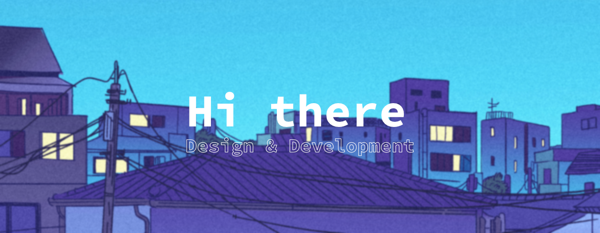

<!--Banner-->

<!--Summary:
  - Introduction
  - Experiences
  - Skills
  - Example Projects
  - hobbies
  - study goals
  - ...
-->

# **Welcome to my Profile** 👋
  
<!--

    

-->
### Design and Development

I'm Nevio from Germany, and I do Graphic Design and Development in my free time. I really enjoy learning new languages and frameworks. 
I also like wireframing, UI, UX, and design in general.

## Hobbies
👨‍💻 Programming 

🎵 Produce and listen to music 

👨‍🍳 Cooking 

🎹 Play the piano

## My Goals for 2023 🗓️
- Expand my C++ coding skills
- Expand my SwiftUI skills
- Beginn to learn Korean 🇰🇷 and Japanese 🇯🇵

## Skills

<!--Projects-->
### My Stats
<!---->

