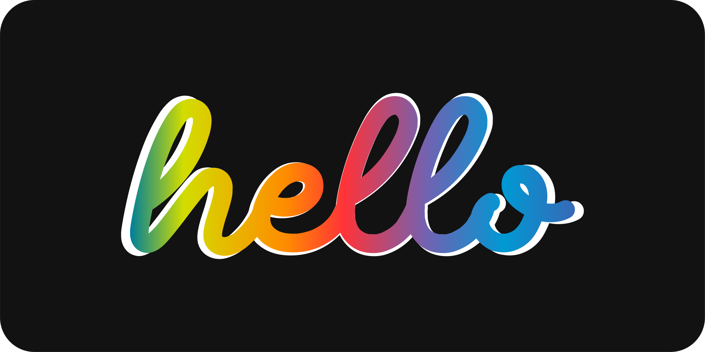

  

# Hey there!

I'm Nevio, a student developer based in Germany focused on **macOS Development, embedded systems, and audio engineering**. I enjoy understanding how things work under the hood from operating system APIs to networking protocol and real-time systems. Outside of programming I work in event technology and live audio, which sparked my interest in audio software and networked audio systems.

If any of my featured projects here interest you, feel freee to take a look, contribute and consider giving the project a ⭐️.

Thanks for stopping by!

### Key Languages

---

[GitHub Projects](https://github.com/N3v1/repositories) · [Email](mailto:n3v1010@gmail.com) · [LinkedIn](https://www.linkedin.com/in/nevioh/)
